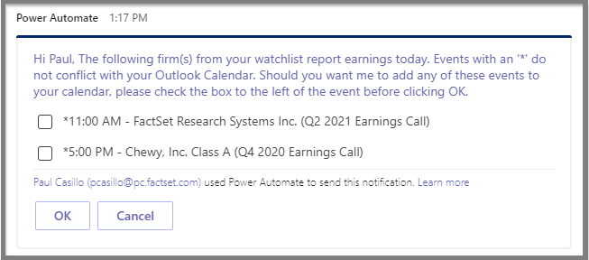
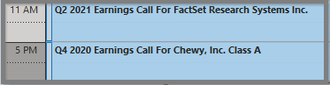

# Efficiently Manage Earnings Season with FactSet and Microsoft Teams

---

### Description  
#####  This Cloud Flow will send an interactive adaptive card every morning detailing what companies in your coverage list are reporting that day.  Based on the selected Outlook calendar, the Adaptive Card will inform you of what events you are available to join live and give you the option to add events to that calendar with all the necessary CallStreet information.
### Requirements
 - **FactSet Username** / **Serial Number** / **[API Key](https://developer.factset.com/authentication)** (Basic Authentication)
  *API Key IP Range must include Microsoft Power Automate's domains
- **[FactSet’s Formula API](https://developer.factset.com/api-catalog/formula-api-time-series)**
- **[Power Automate](https://flow.microsoft.com)** with Premium Action Access (**Per-user plan**)
- **[Microsoft Office 365](https://www.office.com/)** (**Teams** and **Outlook**)

### Supporting Resources
- **[Recipe](https://developer.factset.com/recipe-catalog)**
- **[How-To Video](https://www.factset.com)**

